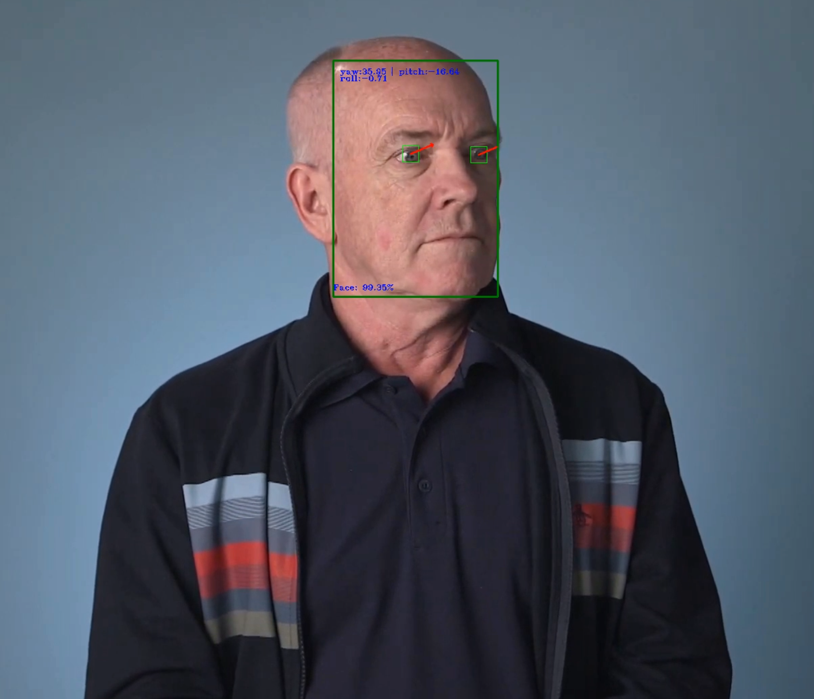
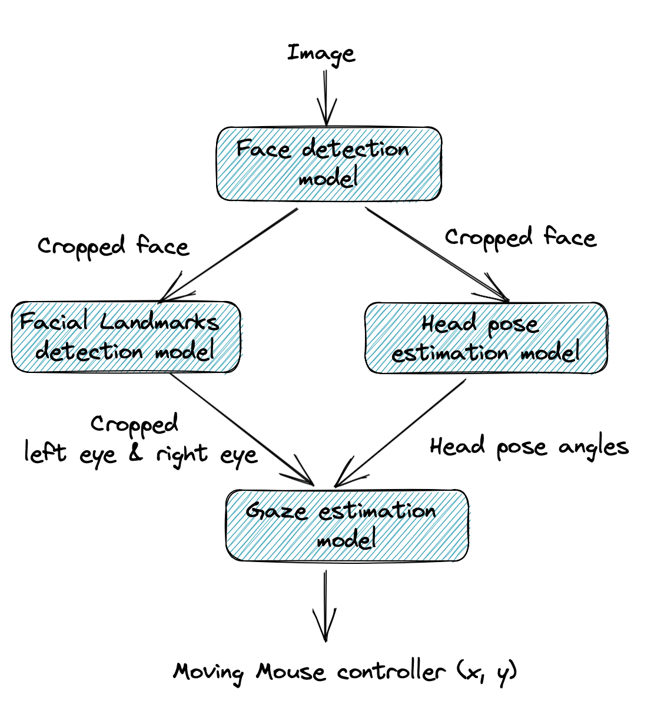

# Computer Pointer Controller

<a name="pipeline"></a>

The project consists of controlling the mouse pointer position according to the gaze of eyes either from a captured video.
For that, a pipeline of several models gets executed on each of the input video frames (see the pipeline image below).

A captured video of the mouse position controlling detection can be found [here](./media/demo_mouse_controller_CPU_FP32.mov)


<a name="demo"></a>

| Details               |              |
|-----------------------|---------------|
| Programming Language |  Python 3.8+|
|Intel® Distribution of OpenVINO™ toolkit| v2022.1.0 |

# Table of content
- [Used models](#models)
- [How does it work?](#how-it-works)
- [Project Set Up](#setup)
- [How to run the code?](#run_code)
- [Benchmarks](#benchmarks)
- [Results](#results)
- [Potential Edge cases](#edge-cases)
- [Further readings](#links)

## Used models
- [Face detection](https://docs.openvino.ai/latest/omz_models_model_face_detection_adas_0001.html)
- [Head pose estimation](https://docs.openvino.ai/latest/omz_models_model_head_pose_estimation_adas_0001.html#doxid-omz-models-model-head-pose-estimation-adas-0001)
- [Facial Landmarks Detection](https://docs.openvino.ai/latest/omz_models_model_landmarks_regression_retail_0009.html)
- [Gaze estimation model](https://docs.openvino.ai/latest/omz_models_model_gaze_estimation_adas_0002.html)

<a name="#how-it-works"></a>
## How does it work?
The pipeline of the different models use is illustrated below


<a name="pipeline"></a>


<a name="setup"></a>
# Project Set Up
*TODO:* Explain the setup procedures to run your project. For instance, this can include your project directory structure, the models you need to download and where to place them etc. Also include details about how to install the dependencies your project requires.

## Setting up the environment
To run the project you need to set up the required packages within a virtual environment either using `venv` or `Conda`.

### Conda environment
- Create a Conda virtual environment from Yaml file `conda env create --file environment.yml`
- You can verify that the new environment was correctly installed using `conda env list`
- Activate the new environment `conda activate mouse-pointer-controller`

To update the existing environment using the environment Yaml file, run the following command

```bash
conda env update --name mouse-pointer-controller --file environment.yml --prune
```
### Virtual environment setup with venv

Create a virtual environment and activate it with the following scripts in the folder `scripts`
```bash
./scripts/create_venv.sh && source ./scripts/activate_venv.sh
```

<a name="run_code"></a>
# How to run the code?

1. Create a virtual environment and activate it as mentioned above
2. Download the models
```bash
cd scripts && ./download_models.sh ../models
```
2. Run the main script located within the `src` folder
```bash
PRECISION=FP16 && MODELS_DIR=models && python src/main.py -i media/demo.mp4 -p $PRECISION -m $MODELS_DIR -d CPU
```
Below is a detailed description of the main script command line arguments
```bash
usage: main.py [-h] -m MODELS_DIR [-i INPUT] [-p PRECISION] [-d DEVICE] [-db]

optional arguments:
  -h, --help            show this help message and exit
  -m MODELS_DIR, --models_dir MODELS_DIR
                        Models directory
  -i INPUT, --input INPUT
                        Path to image or video file. Using the webcam capture by default
  -p PRECISION, --precision PRECISION
                        Floating-point precision e.g. FP32
  -d DEVICE, --device DEVICE
                        Specify the target device to infer on: will look for a suitable plugin for device specified (CPU by default)
  -db, --debug          Set to use the app in debug mode.(False by default)
```
<a name="benchmarks"></a>
## Benchmarks
To perform the benchmark on different model Floating point precisions for a particular device e.g. `CPU`, you can run the command below
```bash
for prec in FP16 FP32 FP16-INT8
do
    PRECISION=$prec && MODELS_DIR=models && python src/main.py -i media/demo.mp4 -p $PRECISION -m $MODELS_DIR -d CPU
done
```
All the benchmarks get exported to a file under the foldr media using the following naming convention `benchmark_<device>_<model_precision>.json`

The reported model loading and inference time below is for the application execution using a CPU processor `2,3 GHz 8-Core Intel Core i9`

### Loading time (sec.)
| Model Precision          |   face-detection-adas-0001 |   landmarks-regression-retail-0009 |   head-pose-estimation-adas-0001 |   gaze-estimation-adas-0002 |
|:----------|---------------------------:|---------------------------------:|-----------------------------------:|----------------------------:|
| FP16-INT8 |                  0.1844  |                        0.0356 |                         0.0495 |                   0.0538 |
| FP16      |                     0.239|                        0.0214 |                         0.0481 |                   0.0377 |
| FP32      |                   0.0986 |                        0.0204 |                         0.0264 |                   0.0303 |
                  
### Model inference time (sec.)
| Model Precision          |   face-detection-adas-0001 |  landmarks-regression-retail-0009 |   head-pose-estimation-adas-0001 |   gaze-estimation-adas-0002 |
|:----------|---------------------------:|---------------------------------:|-----------------------------------:|----------------------------:|
| FP16-INT8 |                  0.0085 |                             0.00049 |       0.0011 |           0.0386 |
| FP16      |                  0.0104 |                             0.000538 |  0.001473 |             1.0  |
| FP32      |                  0.0103 |                             0.000539 |  0.001418 |           0.998  |

<a name="results"></a>
## Results

We notice a high decrease in the inference time with lower floating point precision models (FP32 vs FP16). While there is no big difference in the loading time of the models with relation to the model precision. The Gaze detection model is the one taking most of the time in the whole inference pipeline.

<a name="edge-cases"></a>
## Potential edge Cases
One of the edge cases of this project would be when the face detection model detects multiple faces. In this case, we need to for example keep the face with the highest confidence. Then, apply the rest of the steps of the pipeline on that crop of that detected face. As an additional feature for selecting the right face to select, we could use the size of the detected bounding box.

<a name="links"></a>
## Further readings
- [OpenVINO Model Zoo](https://docs.openvino.ai/latest/model_zoo.html)
